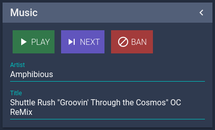

owl-mpc is a [NodeCG](http://github.com/nodecg/nodecg) bundle. 
It works with NodeCG versions which satisfy this [semver](https://docs.npmjs.com/getting-started/semantic-versioning) range: `~0.9.0`
You will need to have an appropriate version of NodeCG installed to use it.

This bundle connects to your MPD server using the [mpc.js](https://github.com/hbenl/mpc-js-node) library.

